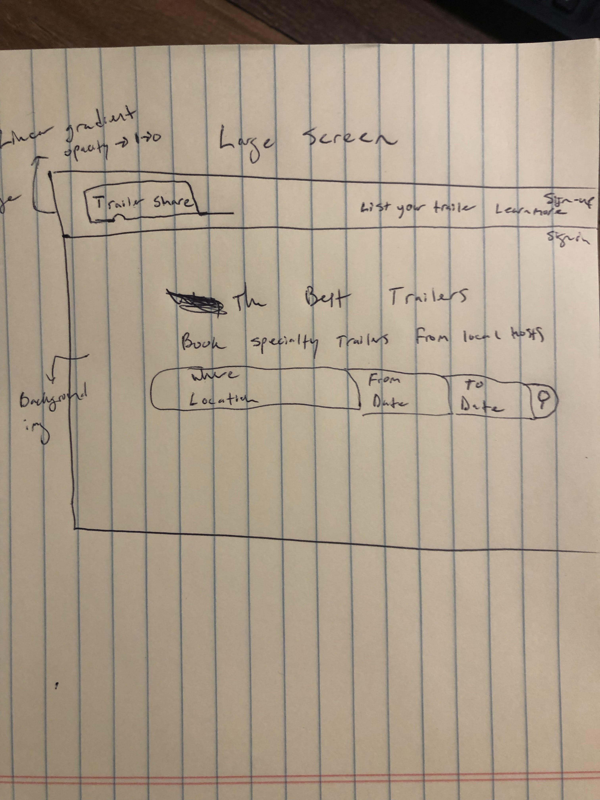
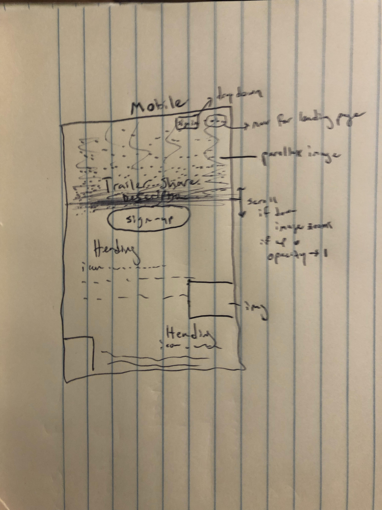

# Trailer Share

## Trailer Share Back Repo

https://github.com/fma126/trailer-share-server

## Technologies Used
Front End
- HTML, SASS, jQuery, JavaScript, HandlebarsJS

Back End
- Ruby, Ruby on Rails, Heroku

## Unsolved problems / next steps

- Develop more reasources on the back end to add functionality of app
- features include:
    - book a trailer
    - save a trailer
    - messaging between hosts and renters
    - payment
    - reviews
    - location of hosts, renters and trailers

## Planning and Development process

I started planning for the project a few days before and decided on the idea because it would be a project that could grow as I my skills grow.  I made ERD diagrams, user stories and wireframes as a starting point for the project.  In the previous project, my landing page was boring and just had a sign-in / sign-up form so I decided to make this full-stack project interesting and try to make the landing page look like a production ready site.  I also learned a lot from the first project when it comes to how to reduce duplication and reuse code and my planning consisted of organising html elements and jQuery methods so that the site was lean and modular.  Next, I began to layout the html framwork of the site and had to wrestle around with the bootstrap components to make them work for me.  One example of doing this is the search section is actually a nav element.  It collapses on small screens and the nav-links are hidden but on large screens it show all nav-links and is expanded vertically instead of horizontally like the default setup of bootstrap.

My goal for the signed in 'flight deck' page was to have three sections all having a scrolling attribute.  The height of the sections wouldn't exceed the veiwport height and it would be easy for fast navigation between the sections.  Also this would make it mobile friendly.

I had a few break throughs while developing this project.  One was how jQuery navigates the DOM and how events 'bubble' through elements.  I learned about propagation and how to listen for and handle events when 'injecting' html into the DOM.

The level of difficulty of problem solving wasn't as hard as the first project and maybe thats because I didn't achieve my strech goals of users being able to book trailes from other users and how to use websockets to listen for changes in state.  I really focused on developing a theme for the UI and putting together a solid foundation to build on.

## User Stories

- A user can sign-up and auto sign-in
- A user can sign-in
- A user can sign-out
- A user can change-password
- A user can create a trailer
- A user can see trailers
- A user can see one trailer
- A user can delete trailers

## Wireframes

## Acknowledgements

Special thanks to my classmates and instructors at GA for helping guide this project.
